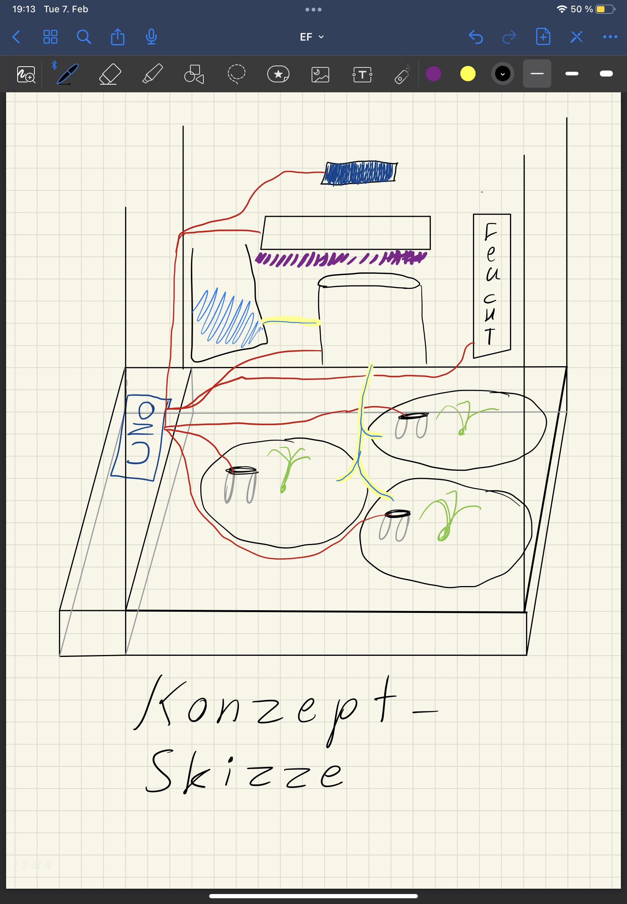
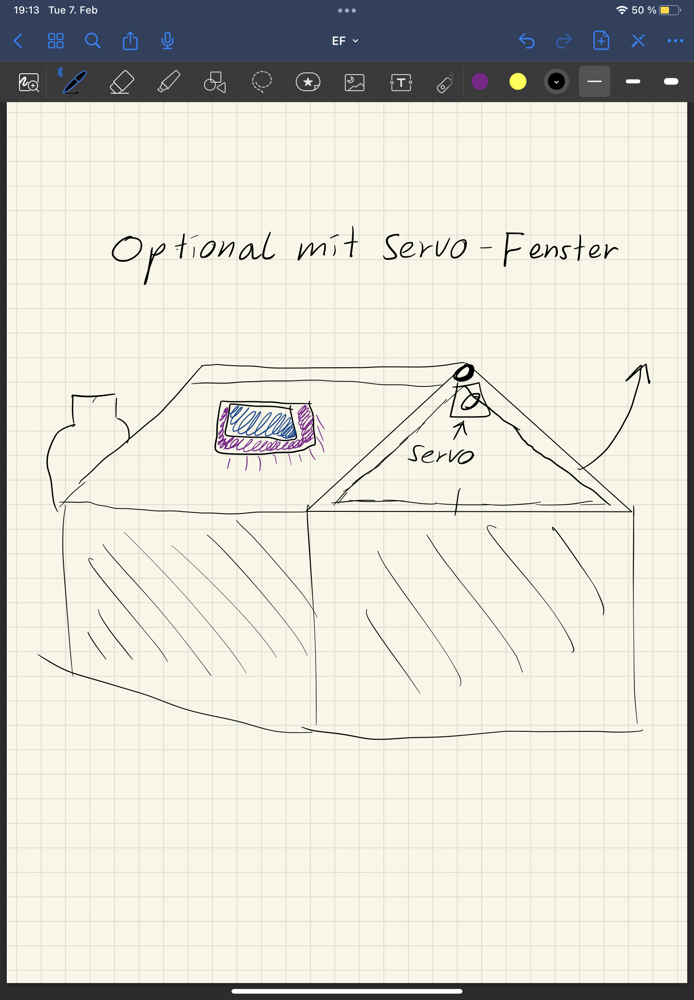
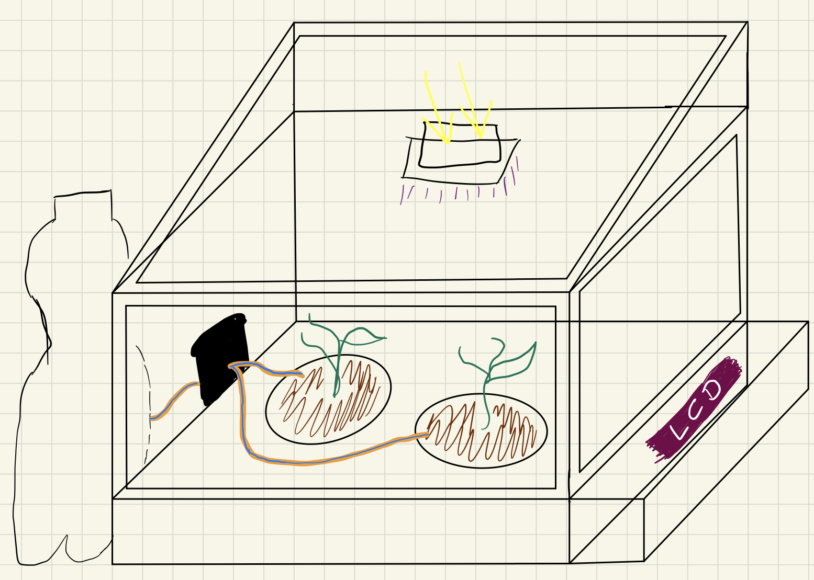
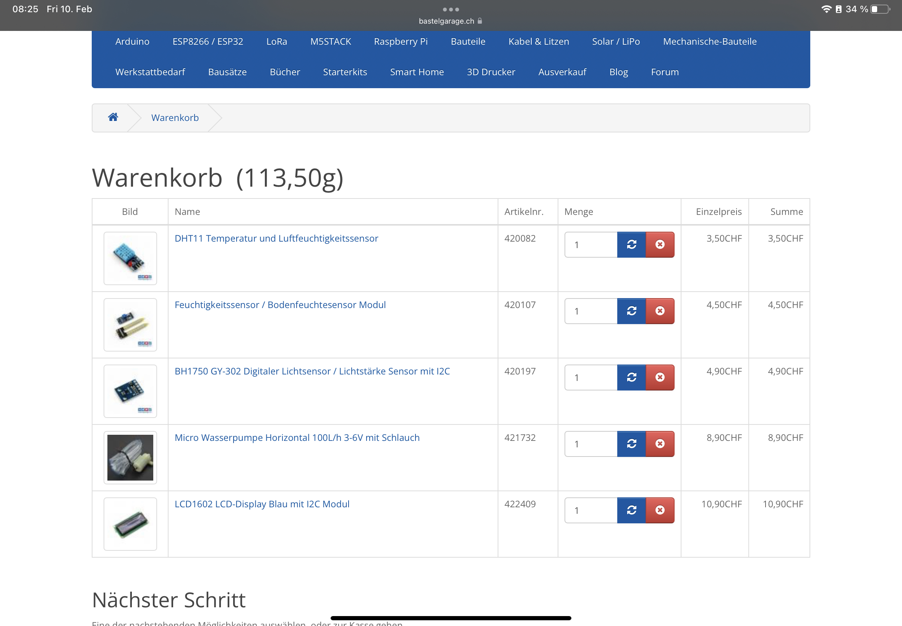
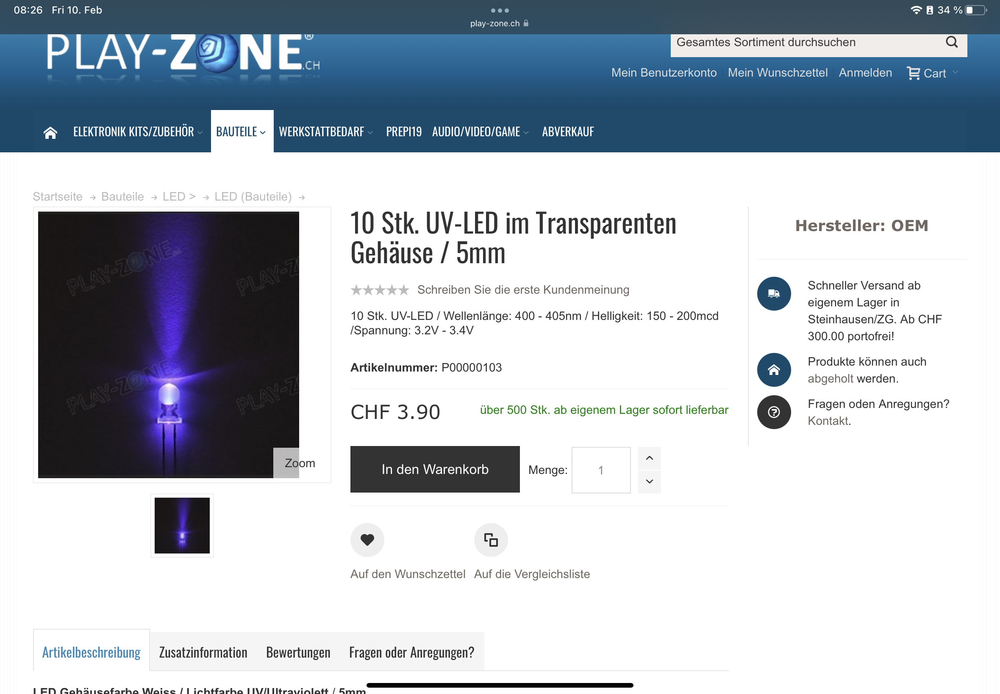

### Dokumentation
# EF-QuartalProjekt
Smartgarden für heranwachsende Pflanzenbabys
## Abstract 
Es handelt sich bei dem Projekt um ein kleines Gewächshaus welches mit Sensoren ausgestattet ist welche, Feuchtigkeit, Wasserzufuhr und Sonnenlicht messen und dem entsprechend Wasser oder Licht supplimieren um der Pflanze die best möglichen Chancen zum aufwachsen geben. Die Statistiken sollen auf einem LCD-Bildschirm zu sehen sein.
## Projekt im Detail
Die Pflanzen sollen in dem Kasten stehen mit den Sensoren an gegebenden Plätzen. Sobald zum Beispiel der Bodenfeuchtigkeitsmesser die Information weitergibt, dass es zu trocken sei soll eine Pumpe aus z.B.s einer mit kleinen Schläuchen verbunden Wasserflaschen (Bzw. irgendein Behälter) Wasser zukommen lassen. Der Licht detektor soll pro Tag die Stunden messen wie lange die Sonne auf ihn geschiehen hat und je nach Pflanzen Art die UV-Lampe Aktivieren oder eben nicht. Informationen zum momentan Stand innerhalb des Gewächshauses sollen auf einem kleinen LCD-Bildschirm angezeigt werden.
### Optional
* Daten an z.B.s einen Webserver leiten und ein simples Interfaces entwerfen, welches die Informationen speichert und mit Graphen wieder gibt um vergangene Werte zu  beobachten. 
* Servomotor, welcher auf Befehl eine Lucke öffnet um Frischluft in den Kasten zu bringen (Gesteuert vom Luftfeuchtigkeitsmesser?)Dazu Dachschräge für aesthetik
### Gewächshaus
Ein selbstgebauter Kasten (Holz, Plastik oder Karton) in dem 1-3 Pflänzchen Platz haben, Sonne abbekommen können und mehr oder weniger sicher sind. 
DIMENSION: 18cmx24cmx18cm (nicht endgültig)
### Sensoren
  * Feuchtigkeitssensor
  * Bodenfeuchtesensor
  * Lichtsensor
### Instrumente 
  * Wasserpumpe
  * UV Lichtstreifen
  * LCD - Display

## Zeitplannung
 | QW2 | QW3 | QW4 | QW5 | QW6 | QW7 | QW8 |
|:------------------ |:-------------------| :-------------------|:------------------ |:-------------------| :-------------------| :-------------------|
| Sämtliche Pläne herstellen            | Kasten fertigstellen              | Schaltung auf Breadboard zum laufen bringen, mögliche Orte im Kasten ausklügeln              | Bauteile im Gewächshaus fixieren und verlöten             | Code               | Code              | Debugging und Projekt samt Dokumentation fertigstellen              |
## Skizzen

# Preiszusammenstellung

 

### Insgesamt 34.60CHF exclusive Arduino und Bausubstanz
