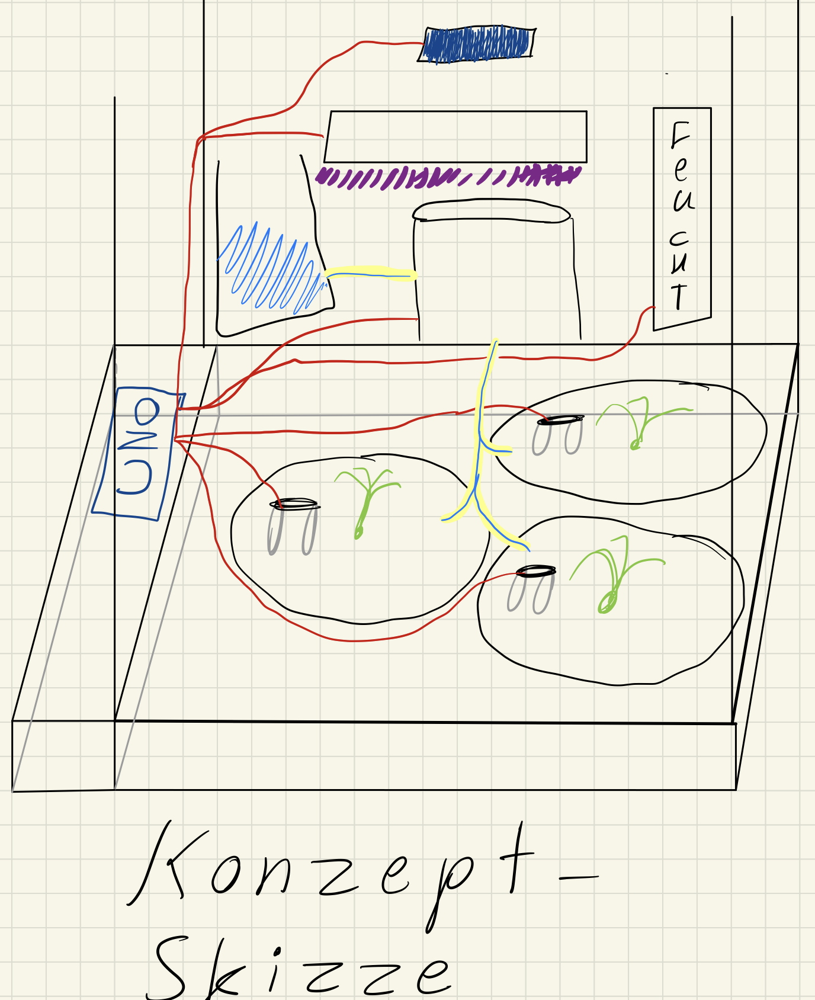

# Dokumentation - EF-QuartalProjekt
Smartgarden für her anwachsende Pflanzenbabys
## Abstract 
Es handelt sich bei dem Projekt um ein kleines Gewächshaus welches mit Sensoren ausgestattet ist welche, Feuchtigkeit, Wasserzufuhr und Sonnenlicht messen und dem entsprechend Wasser oder Licht supplimieren um der Pflanze die best möglichen Chancen zum aufwachsen geben. Die Statistiken sollen auf einem LCD-Bildschirm zu sehen sein.
## Projekt im Detail
Die Pflanzen sollen in dem Kasten stehen mit den Sensoren an gegebenden Plätzen. Sobald zum Beispiel der Bodenfeuchtigkeitsmesser die Information weitergibt, dass es zu trocken sei soll eine Pumpe aus z.B.s einer mit kleinen Schläuchen verbunden Wasserflaschen (Bzw. irgendein Behälter) Wasser zukommen lassen. Der Licht detektor soll pro Tag die Stunden messen wie lange die Sonne auf ihn geschiehen hat und je nach Pflanzen Art die UV-Lampe Aktivieren oder eben nicht. Informationen zum momentan Stand innerhalb des Gewächshauses sollen auf einem kleinen LCD-Bildschirm angezeigt werden.

### Sensoren
  * Feuchtigkeitssensor
  * Bodenfeuchtesensor
  * Lichtsensor
### Instrumente 
  * Wasserpumpe
  * UV Lichtstreifen
  * LCD - Display

# Zeitplannung
 | QW2 | QW3 | QW4 | QW5 | QW6 | QW7 | QW8 |
|:------------------ |:-------------------| :-------------------|:------------------ |:-------------------| :-------------------| :-------------------|
| Sämtliche Pläne herstellen            | Kasten fertigstellen              | Schaltung auf Breadboard zum laufen bringen, mögliche Orte im Kasten ausklügeln              | Bauteile im Gewächshaus fixieren und verlöten             | Code               | Code              | Debugging und Projekt samt Dokumentation fertigstellen              |
## Skizzen

# Logbuch
## Stand 07.02.2023
Sämtliche Komponenten, die es möglicherweise braucht, und Ideen wurden niedergeschrieben. Schwierigkeiten die sicher noch bevor stehen werden ist es eine geeignete Pumpe zu finden, welche nicht zu viel Strom und Platz benötigt. Ausserdem ist das Design so wie es skizziert wurde zu unhandlich und zu gross in dieser Zeit zu verwirklichen. Neue Dimensionen: 100mm x 200mm x 140-200mm

## Stand 14.02.2023
Love is in the air; Alle Teile sind ausgesucht und die Bestellliste ist bereits abgesendet. 

Glücklicherweise gab es eine kleine aber feine Pumpe, welche sicher genug Kraft hat um das Wasser aus dem Behälter in die Töpfe zu bringen.

## Stand 21.02.2023
Durch frühes absenden der Bestellliste konnte ich bereits anfangen zu experimentieren. 

Ich habe rausgefunden das der Ausgang nach oben, der Ausgang ist, welcher das Wasser zu den Pflanzen bringen muss, und der andere and die Quelle gehängt werden muss. Ausserdem ist mir aufgefallen, dass es keine Rolle spielt, ob ich VCC wirklich an das VCC von dem Arduino hänge. 
----------------------------------------------------------------------------------

Nach weiterem ausprobieren mit dem Bodenfeuchtigkeitssenor kam ich zu dem Schluss den DigitalPin komplett zu ignorieren, denn er gibt entweder 1 oder 0 aus, was mir bei dem Bewässern der Pflanze überhaupt nicht helfen wird. Der AnalogPin hingegen gibt mir Werte zwischen 0 und 1023 aus, mit denen ich dann mit Trockener-, Nassererde und Wasser experimentieren konnte. Ich kam auf das Ergebins, dass die Werte bei besserem Leiten immer niediriger Werden. 
Das Anschliessen des Normalen Feuchtigkeitsensores war kinderleicht, denn man musste es nur an einen AnalogPin hängen und alles funktionierte wie gewollt.

## Stand 28.02.2023
Diesen Dienstag probierte ich den Lichtsenor anzuschliessen, was mir viele Schwierigkeiten brachte, da ich noch nicht wusste wie man mit I2C Verbindungen umgeht. Ursprünglich sollen die SDA und SCL Pins 2 und 3 doch mein Gerät funktierte nicht. Nach langem recherchieren kam ich auf einen Beispiel code für den ArduinoUno, der auf wundersameweise bei mir funktionierte, komischerweise nutze er die AnalogPins 4 und 5. An diesem Dienstag war ich nicht zufrieden und deshalb nahm ich mir vor das ganze zu wiederholen

## Stand 07.03.2023
Diese Woche habe ich Schon einigen Code geschrieben, der mit Hilfe der Feuchtigkeitssenoren die Pumpe einschalten sollte, allerdings nicht tat. Das Problem war schon wieder sehr komisch und ich war mir sicher, dass es nicht an mangelndem Strom lag, da die Pumpe mit weniger als 5V einwandfrei lief. Um dem Problem ein einfacher Ende zu bereiten ohne mir gross den Kopf zu zerbrechen hing ich einfach einen Transistor in die Schaltung, die den direkten Stromzugang auf die Pumpe freistellt.
Um auf das Problem der letzten Woche zurückzukommen habe ich alle meine Notizen gelöscht und wieder am Anfang begonnen. Ich habe viele verschiedene Code aus dem Internet ausprobiert und modifiziert, dabei kam ich auf den Schluss, dass eine Libary auf irgendeine Weise gestört hat, ohne sie konnte ich ohne Probleme Lux Werte einlesen. 

## Stand 14.03.2023
Heute war ein höchst erfolgreicher Tag, denn ich hatte eine funktionierende Schaltung auf dem Breadboard und einen funktionierenden Code breits vorbereitet. 
Sobald die Feuchtigkeitssenoren einen Wert unter 500 sendet, läuft die Pumpe bis sie wieder über 500 sind, um den Topf immer gleich feucht zu halten. Ausserdem gehen UV-LEDs an sobald nicht ausreichend Sonnenlicht einfällt. Ich war sehr zufrieden mit meiner Arbeit und fuhr fort mit dem Modellieren eines Gehäuses, dafür experimentierte ich mit einem Lasercutter und lernte wie man Boxen mit Puzzelkanten ausschneidet und schön mit Gravierungen verziehrt

## Stand 21.03.2023 
Ich habe das Gehäuse fertig ausgeschnitten und war nun Bereit alles zu verlöten und verpacken. Das Verlöten brachte mir viele Probleme, da es schwierig war den Überblick zu waren und gleichzeit sämtliche Schaltpläne zu verfolgen. Am Ende des Tages hatte ich zwar ein schönes Gehäuse aber die Kommunikation des Arduino funktionierte nicht mehr. Sämtliche Print-Befehle wurde ignoriert obwohl alles zu funktieren schien. 
## Stand 22.03.2023
Ich habe sämtliche Verbindungen gekappt, um das Problem zu finden. Ich fand keines. Alle Leitungen leiteten richtig und es stand nun aus, dass ich die falschen Pins angesteuert habe. Ich fand mich damit ab, dass dieser Problem nicht in nächster Zeit gelöst werden würde und fing trotzdem an es provisorisch ein zu packen, um es nach der Deadline nochmal korrigieren zu können. 
## Stand 23.03.2023
Heute am Morgen ging es darum alles fest und sauber zu machen. Ich habe meinen Code nach den Kriterien gesäubert und unnötige Dinge gelöscht. Das Gehäuse habe ich mit Heissleim verklebt und den Deckel bloss mit Kabelbindern festgemacht, damit man es noch erreichen kann. 

# Reflexion 
In diesem Quartal habe ich viel gelernt und bin sehr selbstständig geworden. Das Lernen wie man Komponenten richtig Benutzt vieles ging schnell auch wenn ich viele komplett verschiedene Teile in meiner Schaltung eingebaut hatte von denen es oft nur mangelnde Informationen gab. Was weniger gut lief und auch ausschlaggebend auf meine Niederlage war das Arbeiten mit Lötzin und Kupfer. Ich hatte dies zuvor nie richtig gemacht und war deshalb noch nicht professionel damit und die Zeit um genügend zu üben. Im grossen und Ganzen kann man aber sagen, dass ich sehr zufrieden bin zum einen mit meiner Arbeit und und zum anderen wie ich gearbeitet habe. Um das Projekt zu verbessern müsste man nochmal alle Teile auf dem Breadboard aufbauen, um mögliche defekte festzustellen. Ausserdem würde ich beim nächsten Mal eine Art Gewächshaus errichten, da es zum einen besser aussehen würde und zum anderen sicherer vor äusseren Faktoren ist. Neben diesem Feature würde ich ein Programm hinzufügen, welches verschiedene Konfigurationen gespeichert hat, da nicht jede Pflanze gleichviel Nährstoffe oder Licht benötigt. 

# Code 

`
#include <Wire.h>
#include <BH1750.h>
#include "DHT.h"

// Constants
const unsigned long INTERVAL = 1000 * 3;
const int PLANT_LIGHT = 1000;
const int PLANT_TIMER = 1000 * 60 * 6;
const int FEUCHT_PIN = A2;
const int DHT_TYPE = DHT11;
const int SENSOR2_PIN = A4;
const int SENSOR3_PIN = A3;
const int PUMP_PIN = 12;
const int SCL_PIN = 2;
const int SDA_PIN = 3;
const int LED_PIN = 6;

// Global variables
unsigned long previousTime = 0;
int sensor2 = 0;
int sensor3 = 0;

// Objects
DHT dht(FEUCHT_PIN, DHT_TYPE);
BH1750 lightMeter;

void setup() {
  Serial.begin(9600);
  dht.begin();
  lightMeter.begin();
  pinMode(SENSOR2_PIN, INPUT);
  pinMode(SENSOR3_PIN, INPUT);
  pinMode(PUMP_PIN, OUTPUT);
  pinMode(SCL_PIN, INPUT);
  pinMode(SDA_PIN, INPUT);
  pinMode(LED_PIN, OUTPUT);
}

void loop() {
  Serial.print("hello");
  unsigned long currentTime = millis();
 
  if (currentTime - previousTime >= INTERVAL) {
    previousTime = currentTime;
    uint16_t lux = lightMeter.readLightLevel();
    float humidity = dht.readHumidity();
    float temperature = dht.readTemperature();

    sensor2 = analogRead(SENSOR2_PIN);
    sensor3 = analogRead(SENSOR3_PIN);

    Serial.print("Soil: ");
    Serial.print(sensor2);
    Serial.print(", ");
    Serial.print(sensor3);
    Serial.println();

    Serial.print("Humidity: ");
    Serial.print(humidity);
    Serial.println("%");

    Serial.print("Temperature: ");
    Serial.print(temperature);
    Serial.println("°C");

    Serial.print("Light: ");
    Serial.print(lux);
    Serial.println("lx");

    if (sensor2 < 500 && sensor3 < 500) {
      digitalWrite(PUMP_PIN, HIGH);
      Serial.print("allo");
    } else {
      digitalWrite(PUMP_PIN, LOW);
    }

    if (lux <= PLANT_LIGHT) {
      digitalWrite(LED_PIN, HIGH);
    } else {
      digitalWrite(LED_PIN, LOW);
    }
  }
}
`
