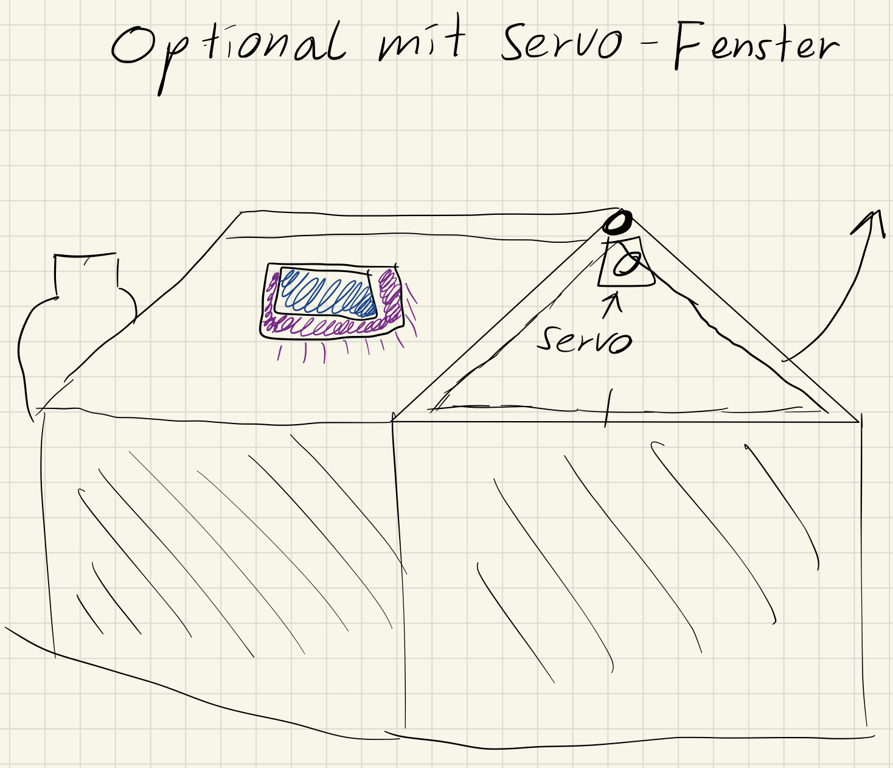

# Dokumentation - EF-QuartalProjekt
Smartgarden für her anwachsende Pflanzenbabys
## Abstract 
Es handelt sich bei dem Projekt um ein kleines Gewächshaus, welches mit Sensoren ausgestattet ist, welche Feuchtigkeit, Wasserzufuhr und Sonnenlicht messen und dementsprechend Wasser oder Licht zuführen, um der Pflanze die bestmöglichen Chancen zum Aufwachsen zu geben. 
## Projekt im Detail
Die Pflanzen sollen in dem Kasten stehen, mit den Sensoren an gegebenen Plätzen. Sobald zum Beispiel der Bodenfeuchtigkeitssensor die Information weitergibt, dass es zu trocken ist, soll eine Pumpe aus z.B. einer mit kleinen Schläuchen verbundenen Wasserflasche (bzw. irgendeinem Behälter) Wasser zukommen lassen. Der Lichtdetektor soll pro Tag die Stunden messen, wie lange die Sonne auf ihn scheint, und je nach Pflanzenart die UV-Lampe aktivieren oder eben nicht.
### Sensoren
  * Feuchtigkeitssensor
  * Bodenfeuchtesensor
  * Lichtsensor
### Instrumente 
  * Wasserpumpe
  * UV Lichtstreifen
  * LCD - Display

# Zeitplannung
 | QW2 | QW3 | QW4 | QW5 | QW6 | QW7 | QW8 |
|:------------------ |:-------------------| :-------------------|:------------------ |:-------------------| :-------------------| :-------------------|
| Sämtliche Pläne herstellen            | Kasten fertigstellen              | Schaltung auf Breadboard zum laufen bringen, mögliche Orte im Kasten ausklügeln              | Bauteile im Gewächshaus fixieren und verlöten             | Code               | Code              | Debugging und Projekt samt Dokumentation fertigstellen              |
## Skizzen





# Logbuch
## Stand 07.02.2023
Sämtliche Komponenten, die möglicherweise gebraucht werden, und Ideen wurden niedergeschrieben. Schwierigkeiten, die sicher noch bevorstehen werden, sind eine geeignete Pumpe zu finden, welche nicht zu viel Strom und Platz benötigt. Außerdem ist das Design so, wie es skizziert wurde, zu unhandlich und zu groß in dieser Zeit zu verwirklichen. Neue Dimensionen: 100 mm x 200 mm x 140-200 mm.

## Stand 14.02.2023
Love is in the air; Alle Teile sind ausgesucht und die Bestellliste ist bereits abgesendet.


Glücklicherweise gab es eine kleine, aber feine Pumpe, welche sicher genug Kraft hat, um das Wasser aus dem Behälter in die Töpfe zu bringen.


## Stand 21.02.2023
Durch frühes Absenden der Bestellliste konnte ich bereits anfangen zu experimentieren.


Ich habe herausgefunden, dass der Ausgang nach oben der Ausgang ist, welcher das Wasser zu den Pflanzen bringen muss, und der andere an die Quelle gehängt werden muss. Außerdem ist mir aufgefallen, dass es keine Rolle spielt, ob ich VCC wirklich an das VCC von dem Arduino hänge.

----------------------------------------------------------------------------------

Nach weiterem Ausprobieren mit dem Bodenfeuchtigkeitssensor kam ich zu dem Schluss, den DigitalPin komplett zu ignorieren, denn er gibt entweder 1 oder 0 aus, was mir bei dem Bewässern der Pflanze überhaupt nicht helfen wird. Der AnalogPin hingegen gibt mir Werte zwischen 0 und 1023 aus, mit denen ich dann mit trockener Erde, nasser Erde und Wasser experimentieren konnte. Ich kam auf das Ergebnis, dass die Werte bei besserem Leiten immer niedriger werden. Das Anschließen des normalen Feuchtigkeitssensors war kinderleicht, denn man musste ihn nur an einen AnalogPin hängen und alles funktionierte wie gewollt.

## Stand 28.02.2023
Diesen Dienstag probierte ich den Lichtsensor anzuschließen, was mir viele Schwierigkeiten brachte, da ich noch nicht wusste, wie man mit I2C-Verbindungen umgeht. Ursprünglich sollen die SDA- und SCL-Pins 2 und 3 sein, doch das funktionierte so nicht. Nach langem Recherchieren kam ich auf einen Beispielcode für den Arduino Uno, der auf wundersame Weise bei mir funktionierte. Komischerweise nutzte er die AnalogPins 4 und 5. An diesem Dienstag war ich nicht zufrieden und deshalb nahm ich mir vor, das Ganze zu wiederholen.
## Stand 07.03.2023
Diese Woche habe ich schon einigen Code geschrieben, der mit Hilfe der Feuchtigkeitssensoren die Pumpe einschalten sollte, aber nicht tat. Das Problem war schon wieder sehr seltsam, und ich war mir sicher, dass es nicht an mangelndem Strom lag, da die Pumpe mit weniger als 5V einwandfrei lief. Um dem Problem ein einfaches Ende zu bereiten, ohne mir groß den Kopf zu zerbrechen, hängte ich einfach einen Transistor in die Schaltung, die den direkten Stromzugang auf die Pumpe freistellt. Um auf das Problem der letzten Woche zurückzukommen, habe ich alle meine Notizen gelöscht und wieder von vorne begonnen. Ich habe viele verschiedene Codes aus dem Internet ausprobiert und modifiziert, dabei kam ich zu dem Schluss, dass eine Library auf irgendeine Weise gestört hat, ohne sie konnte ich ohne Probleme Lux-Werte einlesen.
## Stand 14.03.2023
Heute war ein höchst erfolgreicher Tag, denn ich hatte eine funktionierende Schaltung auf dem Breadboard und einen funktionierenden Code bereits vorbereitet. Sobald die Feuchtigkeitssensoren einen Wert unter 500 senden, läuft die Pumpe bis sie wieder über 500 sind, um den Topf immer gleich feucht zu halten. Außerdem gehen UV-LEDs an, sobald nicht ausreichend Sonnenlicht einfällt.

```
#include <Wire.h>
#include <BH1750.h>
unsigned long pTime = 0;
const unsigned long interval1 = 1000*3; //eine sekunde*3
const int plantlight = 1000; //je nach pflanze varierent
const int planttimer = 1000*60*6; //eine sekunde * eine minute * anzahle stunden licht die es braucht
#include "DHT.h"                
#define Feucht A2          
#define DHTTYPE DHT11
DHT dht(Feucht, DHTTYPE);
BH1750 lightMeter;
#define Sensor2 A4
#define Sensor3 A3
#define Pump 12
#define SCL 2
#define SDA 3
#define LED 6
int sen2=0;
int sen3=0;
void setup() {
Serial.begin(9600);
dht.begin();
lightMeter.begin();
pinMode(Sensor2,INPUT);
pinMode(Sensor3,INPUT);
pinMode(Pump,OUTPUT);
pinMode(SCL,INPUT);
pinMode(SDA,INPUT);
pinMode(LED,OUTPUT);
}

void loop() {
  Serial.print("hello");
  unsigned long currentTime = millis();
  if (currentTime - pTime >= interval1) {
    pTime = currentTime;
    uint16_t lux = lightMeter.readLightLevel();
    float feu=dht.readHumidity();
    float temp=dht.readTemperature();
    /*FUNKTIONIERT*/
    /*sen2=analogRead(Sensor2);sen3=analogRead(Sensor3);*/
    sen2=100;sen3=100;
    Serial.print("Boden:");;Serial.print(sen2);Serial.print(sen3);Serial.println();
    Serial.print("Luft:");Serial.print(feu);Serial.println("%");
    Serial.print("Temperatur:");Serial.print(temp);Serial.println("°C");
    Serial.print("Licht:");Serial.print(lux);Serial.println("lx");
    if(sen2<500 && sen3<500) {
      digitalWrite(Pump,HIGH);
      Serial.print("allo");
    }
    else{digitalWrite(Pump,LOW);}

    if(lux<=plantlight){
      digitalWrite(LED,HIGH);
      }
    else{digitalWrite(LED,LOW);}
      
  }
}

```
Ich war sehr zufrieden mit meiner Arbeit und fuhr fort mit dem Modellieren eines Gehäuses. Dafür experimentierte ich mit einem Lasercutter und lernte, wie man Boxen mit Puzzlekanten ausschneidet und schön mit Gravierungen verziert.


## Stand 21.03.2023 
Entspurt! Ich habe das Gehäuse fertig ausgeschnitten und war nun bereit, alles zu verlöten und zu verpacken. Das Verlöten brachte mir viele Probleme, da es schwierig war, den Überblick zu wahren und gleichzeitig sämtliche Schaltpläne zu verfolgen. Am Ende des Tages hatte ich zwar ein schönes Gehäuse, aber die Kommunikation des Arduino funktionierte nicht mehr. Sämtliche Print-Befehle wurden ignoriert, obwohl alles zu funktionieren schien.
## Stand 22.03.2023
Ich habe sämtliche Verbindungen gekappt, um das Problem zu finden. Ich fand keines. Alle Leitungen leiteten richtig und es stand nun fest, dass ich auf keinen Fall die falschen Pins angesteuert habe. Ich fand mich damit ab, dass dieses Problem nicht in nächster Zeit gelöst werden würde, und fing trotzdem an, es provisorisch einzupacken, um es nach der Deadline nochmal korrigieren zu können.


## Stand 23.03.2023
Heute am Morgen ging es darum, alles fest und sauber zu machen. Ich habe meinen Code nach den Kriterien gesäubert und unnötige Dinge gelöscht. Das Gehäuse habe ich mit Heißleim verklebt und den Deckel bloß mit Kabelbindern festgemacht, damit man es noch erreichen kann.

# Reflexion 
In diesem Quartal habe ich viel gelernt und bin sehr selbstständig geworden. Das Lernen, wie man Komponenten richtig benutzt, ging schnell, auch wenn ich viele komplett verschiedene Teile in meiner Schaltung eingebaut hatte, von denen es oft nur mangelnde Informationen gab. Was weniger gut lief und auch ausschlaggebend auf meine Niederlage war, war das Arbeiten mit Lötzinn und Kupfer. Ich hatte dies zuvor nie richtig gemacht und war deshalb noch nicht professionell damit und hatte nicht genug Zeit, um genügend zu üben. Im Großen und Ganzen kann man aber sagen, dass ich sehr zufrieden bin, zum einen mit meiner Arbeit und zum anderen, wie ich gearbeitet habe.

Um das Projekt zu verbessern, müsste man nochmal alle Teile auf dem Breadboard aufbauen, um mögliche Defekte festzustellen. Außerdem würde ich beim nächsten Mal eine Art Gewächshaus errichten, da es zum einen besser aussehen würde und zum anderen sicherer vor äußeren Faktoren ist. Neben diesem Feature würde ich noch ein Programm schreiben, welches verschiedene Konfigurationen gespeichert hat, da nicht alle Pflanzen die selben Anforderungen.


# Code 

```
#include <Wire.h>
#include <BH1750.h>
#include "DHT.h"

// Constants
const unsigned long INTERVAL = 1000 * 3;
const int PLANT_LIGHT = 1000;
const int PLANT_TIMER = 1000 * 60 * 6;
const int FEUCHT_PIN = A2;
const int DHT_TYPE = DHT11;
const int SENSOR2_PIN = A4;
const int SENSOR3_PIN = A3;
const int PUMP_PIN = 12;
const int SCL_PIN = 2;
const int SDA_PIN = 3;
const int LED_PIN = 6;

// Global variables
unsigned long previousTime = 0;
int sensor2 = 0;
int sensor3 = 0;

// Objects
DHT dht(FEUCHT_PIN, DHT_TYPE);
BH1750 lightMeter;

void setup() {
  Serial.begin(9600);
  dht.begin();
  lightMeter.begin();
  pinMode(SENSOR2_PIN, INPUT);
  pinMode(SENSOR3_PIN, INPUT);
  pinMode(PUMP_PIN, OUTPUT);
  pinMode(SCL_PIN, INPUT);
  pinMode(SDA_PIN, INPUT);
  pinMode(LED_PIN, OUTPUT);
}

void loop() {
  Serial.print("hello");
  unsigned long currentTime = millis();
 
  if (currentTime - previousTime >= INTERVAL) {
    previousTime = currentTime;
    uint16_t lux = lightMeter.readLightLevel();
    float humidity = dht.readHumidity();
    float temperature = dht.readTemperature();

    sensor2 = analogRead(SENSOR2_PIN);
    sensor3 = analogRead(SENSOR3_PIN);

    Serial.print("Soil: ");
    Serial.print(sensor2);
    Serial.print(", ");
    Serial.print(sensor3);
    Serial.println();

    Serial.print("Humidity: ");
    Serial.print(humidity);
    Serial.println("%");

    Serial.print("Temperature: ");
    Serial.print(temperature);
    Serial.println("°C");

    Serial.print("Light: ");
    Serial.print(lux);
    Serial.println("lx");

    if (sensor2 < 500 && sensor3 < 500) {
      digitalWrite(PUMP_PIN, HIGH);
      Serial.print("allo");
    } else {
      digitalWrite(PUMP_PIN, LOW);
    }

    if (lux <= PLANT_LIGHT) {
      digitalWrite(LED_PIN, HIGH);
    } else {
      digitalWrite(LED_PIN, LOW);
    }
  }
}
//Falls dieser Code fehler haben sollte,  bitte den schmutzigen alten code benutzen
```
